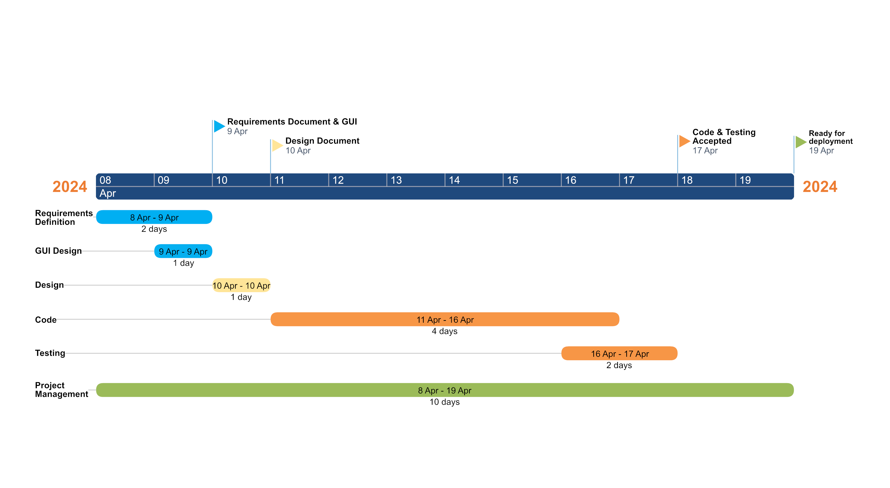

# Project Estimation - FUTURE
Date: 02/05/2024

Version: 2

# Estimation approach
Consider the EZElectronics  project in FUTURE version (as proposed by your team in requirements V2), assume that you are going to develop the project INDEPENDENT of the deadlines of the course, and from scratch (not from V1)
# Estimate by size
### 
|             | Estimate                        |             
| ----------- | ------------------------------- |  
| NC =  Estimated number of classes to be developed   |                14             |             
|  A = Estimated average size per class, in LOC       |                 200           | 
| S = Estimated size of project, in LOC (= NC * A) |    2800            |          
| E = Estimated effort, in person hours (here use productivity 10 LOC per person hour)  |   280 ph                                  |   
| C = Estimated cost, in euro (here use 1 person hour cost = 30 euro) | 8400 euros | 
| Estimated calendar time, in calendar weeks (Assume team of 4 people, 8 hours per day, 5 days per week ) |       1.75 weeks             |               

# Estimate by product decomposition
### 
|         component name    | Estimated effort (person hours)   |             
| ----------- | ------------------------------- | 
|requirement document    | 40 |
| GUI prototype |7|
|design document |9|
|**code**   - _User Classes_   - _Product Classes_   - _Cart Classes_   - _Payment Class_   - _Ad class_      |**130**   45   40   30   10   5   |
| unit tests |30|
| api tests |20|
| management documents  |7|

# Estimate by activity decomposition
### 
|         Activity name    | Estimated effort (person hours)   |             
| ----------- | ------------------------------- | 
|Requirements Definition | 40 |
| GUI Design | 7 |
| Design | 9 |
| Implementation (code & testing) | 180 |
| Project Management | 7 |

# Summary

Report here the results of the three estimation approaches. The  estimates may differ. Discuss here the possible reasons for the difference

When estimating by size, factors such as number of features and lines of code affect the estimated effort, however, it does not take into account the varying complexities of the features as some features would be easier to manage than others and would thus require less effort. When estimating by product decomposition the complexity of the different modules becomes more clear and it becomes apparent that which parts of the development will take more time and effort. With the estimation by activity, the most accurate time duration can be seen as it takes into account the sequence of events. It allows the visualization (as in the Gantt Chart above) of the activities that can be done in parallel and which activities can only be done when the previous have been completed.

|             | Estimated effort                        |   Estimated duration |          
| ----------- | ------------------------------- | ---------------|
| estimate by size |280 | 8.75 days |
| estimate by product decomposition | 243 |7.5 days |
| estimate by activity decomposition |243 | 10 days |

