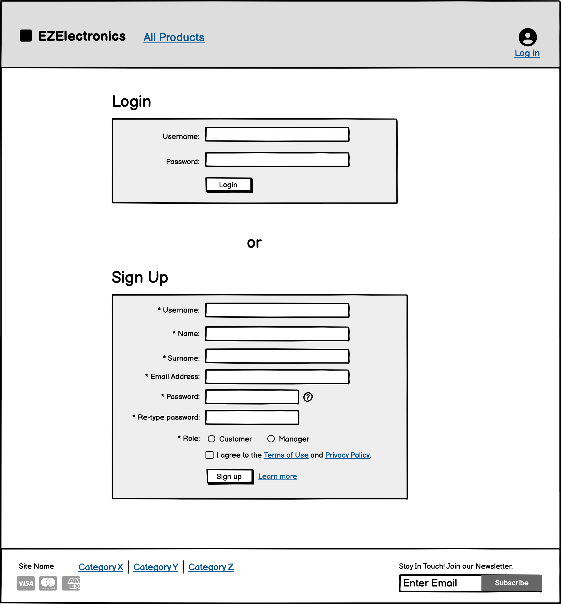

# Graphical User Interface Prototype - FUTURE

Authors: Andrea Pani, Rossana Della Corte, Zirui Luo, Zurehma Ayesha Rameez

Date: 03/05/2024

Version: 2

## User - All Products (before login)

### Use cases:
- **View all products**: the user can browse all products without logging in. The customer does not have a cart until they log in nor can they view the products by category until they log in. The manager cannot update the inventory until they log in. 

## User - Login or Signup

### Use cases:
- **Login**: The User can log in to an existing account using their username and password.
- **Create new account**: The User can sign up to create a new account by entering their information and choosing whether they are a customer or manager.

## User - Homepage after login

### Use cases:
- **Login**: Once the user successfullt logs in, they are redirected to the homepage where the navigation bar becomes accessible.

## Customer - Home

### Use cases:
- **Search products by category**: the Customer can browse products by category using the navigation links of the navigation bar. Also the rating of each product is shown.
- **Search products by model**: the Customer can search products by model using the search bar in the upper-right corner
- **Add products to Cart**: the Customer can add products to the Cart by using the "Add to Cart" button on the bottom of the desired product card.
- **Manage ads**: the Customer sees the ads on the right of the page

## Customer - Cart

### Use cases:
- **View cart**: the Customer can view the Cart by using the cart icon on the right of the navigation bar, also showing the number of Products currently in the Cart
- **Delete products from cart**: the Customer can delete products from the Cart by using the delete icon located on the right of every list item
- **Pay for the cart**: the Customer can start the payment procedure for the Cart by using the "Pay for the Cart" button located on the bottom of the cart summary card, that is also showing the total that needs to be payed

## Customer - Cart, Shipping Method

### Use cases:
- **Pay for the cart**: the Customer can specify the shipping method and the shipping address in the main section of the page

## Customer - Cart, Payment Method

### Use cases:
- **Pay for the cart**: the Customer can specify the payment method and the credit card details in the main section of the page. The payment procedure can be concluded by clicking on the button "Complete payment" 

## Customer - Cart history

### Use cases:
- **View cart history**: the Customer can view the Cart history by hovering on the account icon and then selecting the link "View cart history". The requested page will show the history of paid carts, with the total paid and the list of products that were selected

## Customer - Cart history, Rating

### Use cases:
- **Rate a product**: the Customer can rate a product by clicking on the "Rate product" button inside the paid cart section. An alert textbox will appear when the Customer can specify the rating for that product. This will affect the mean rating of the product on the product page.

## Customer - Account

### Use cases:
- **Delete user**: the Customer can delete the account by using the "Delete account" button, that will trigger a popup to confirm the irreversible operation.
- **Update user information**: the Customer can update user information by clicking on the "Edit" icon and changing the text in the corresponding field textboxes.

## Manager - Home

### Use cases:
- **Search products by category**: the Manager can browse products by category using the navigation links of the navigation bar
- **Search products by model**: the Manager can search products by model using the search bar in the upper-right corner

The Manager can use the dropdown menu in the upper-right corner to navigate easily in the sections of his account:

Manager personal account:

## Manager - Create a new Product

### Use cases:
**Create new Product** : the Managere can create a new product filling the fields shown in the page and also adding one ore more images of the product he wants to sell

## Manager - Register the arrival date of products

### Use cases:
**Register new arrival date** : the Manager can add a new arrival filling the fields

## Manager - Mark a product as SOLD

### Use cases:
**Marks a product as sold:** the Manager can search a product and control the remaining quantity, if it's already 0 it means the product is out of stock so it will be marked as sold, otherwise the manager can register a new arrival of that product (Use case: Register the arrival date of products) and than the quantity of the product will be updated

