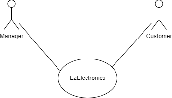
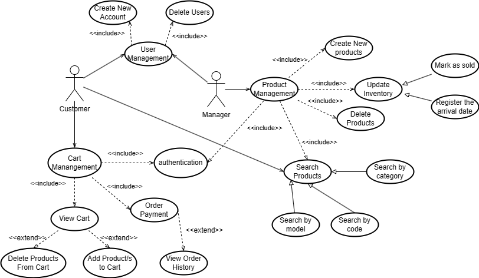
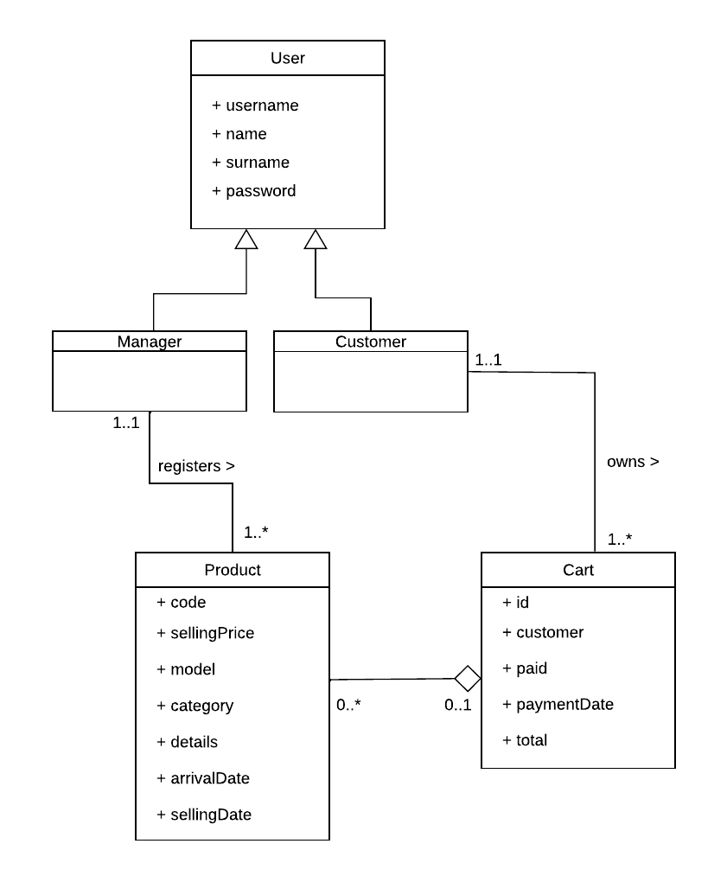
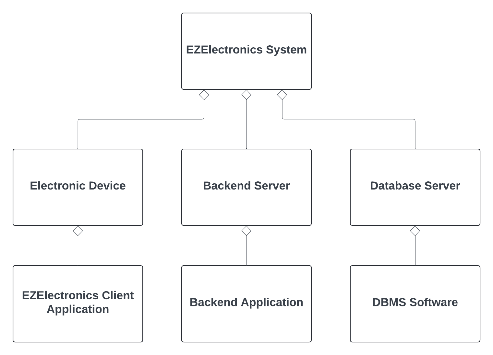
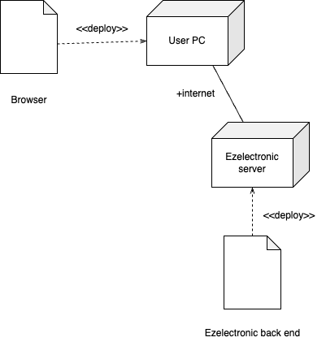

# Requirements Document - current EZElectronics

Date: 27/04/2024

Version: V1 - description of EZElectronics in CURRENT form (as received by teachers)

| Version number | Change |
| :------------: | :----: |
|                |        |

# Contents

- [Requirements Document - current EZElectronics](#requirements-document---current-ezelectronics)
- [Contents](#contents)
- [Informal description](#informal-description)
- [Stakeholders](#stakeholders)
- [Context Diagram and interfaces](#context-diagram-and-interfaces)
  - [Context Diagram](#context-diagram)
  - [Interfaces](#interfaces)
- [Stories and personas](#stories-and-personas)
- [Functional and non functional requirements](#functional-and-non-functional-requirements)
  - [Functional Requirements](#functional-requirements)
  - [Non Functional Requirements](#non-functional-requirements)
- [Use case diagram and use cases](#use-case-diagram-and-use-cases)
  - [Use case diagram](#use-case-diagram)
    - [Use case 1, UC1](#use-case-1-uc1)
      - [Scenario 1.1](#scenario-11)
      - [Scenario 1.2](#scenario-12)
      - [Scenario 1.3](#scenario-13)
    - [Use case 2, UC2](#use-case-2-uc2)
      - [Scenario 2.1](#scenario-21)
      - [Scenario 2.2](#scenario-22)
    - [Use case 3, UC3](#use-case-3-uc3)
      - [Scenario 3.1](#scenario-31)
    - [Use case 4, UC4](#use-case-4-uc4)
      - [Scenario 4.1](#scenario-41)
      - [Scenario 4.2](#scenario-42)
    - [Use case 5, UC5](#use-case-5-uc5)
      - [Scenario 5.1](#scenario-51)
      - [Scenario 5.2](#scenario-52)
      - [Scenario 5.3](#scenario-53)
      - [Scenario 5.4](#scenario-54)
    - [Use case 6, UC6](#use-case-6-uc6)
      - [Scenario 6.1](#scenario-61)
      - [Scenario 6.2](#scenario-62)
    - [Use case 7, UC7](#use-case-7-uc7)
      - [Scenario 7.1](#scenario-71)
      - [Scenario 7.2](#scenario-72)
      - [Scenario 7.3](#scenario-73)
      - [Scenario 7.4](#scenario-74)
      - [Scenario 7.5](#scenario-75)
    - [Use case 8, UC8](#use-case-8-uc8)
      - [Scenario 8.1](#scenario-81)
      - [Scenario 8.2](#scenario-82)
      - [Scenario 8.3](#scenario-83)
    - [Use case 9, UC9](#use-case-9-uc9)
      - [Scenario 9.1](#scenario-91)
      - [Scenario 9.2](#scenario-92)
    - [Use case 10, UC10](#use-case-10-uc10)
      - [Scenario 10.1](#scenario-101)
      - [Scenario 10.2](#scenario-102)
      - [Scenario 10.3](#scenario-103)
    - [Use case 11, UC11](#use-case-11-uc11)
      - [Scenario 11.1](#scenario-111)
      - [Scenario 11.2](#scenario-112)
      - [Scenario 11.3](#scenario-113)
    - [Use case 12, UC12](#use-case-12-uc12)
      - [Scenario 12.1](#scenario-121)
      - [Scenario 12.2](#scenario-122)
    - [Use case 13, UC13](#use-case-13-uc13)
      - [Scenario 13.1](#scenario-131)
      - [Scenario 13.2](#scenario-132)
      - [Scenario 13.3](#scenario-133)
      - [Scenario 13.4](#scenario-134)
    - [Use case 14, UC14](#use-case-14-uc14)
      - [Scenario 14.1](#scenario-141)
      - [Scenario 14.2](#scenario-142)
      - [Scenario 14.3](#scenario-143)
    - [Use case 15, UC15](#use-case-15-uc15)
      - [Scenario 15.1](#scenario-151)
      - [Scenario 15.2](#scenario-152)
      - [Scenario 15.3](#scenario-153)  
      - [Scenario 15.4](#scenario-153)  
      - [Scenario 15.5](#scenario-153)
    - [Use case 16, UC16](#use-case-16-uc16)
      - [Scenario 16.1](#scenario-161)
      - [Scenario 16.2](#scenario-162)  
    - [Use case 17, UC17](#use-case-17-uc17)
      - [Scenario 17.1](#scenario-171)
      - [Scenario 17.2](#scenario-172)
    - [Use case 18, UC18](#use-case-18-uc18)
      - [Scenario 18.1](#scenario-181)
      - [Scenario 18.2](#scenario-182)
- [Glossary](#glossary)
- [System Design](#system-design)
- [Deployment Diagram](#deployment-diagram)

# Informal description

EZElectronics (read EaSy Electronics) is a software application designed to help managers of electronics stores to manage their products and offer them to customers through a dedicated website. Managers can assess the available products, record new ones, and confirm purchases. Customers can see available products, add them to a cart and see the history of their past purchases.

# Stakeholders

| Stakeholder name | Description |
| :--------------: | :---------: |
| Manager          |   The person in charge of the store who will be updating product information and process orders          |
| Store Owner      |   The owner of the store who will be buying the EZElectronics software for their store         |
| Customer         |   The person who will be accessing the website of the electronics store to order products           |
| Developer        |   The person/team who will be designing and coding the EZElectronics software          |
| Supplier         |   The person/company that will be supplying electronics (smartphones, laptops, appliances) to the electronics store         |
| Support team | Developer assigned team that will be in charge of assisting the manager in case of technical difficulties with the software         |

# Context Diagram and interfaces

## Context Diagram

## Interfaces

|   Actor         | Logical Interface | Physical Interface |
| :-------------: | :---------------: | :----------------: |
| Manager         | GUI               | Device             |
| Customer        | GUI               | Device             |

# Stories and personas

**Persona 1: Store manager, Middle-aged person**\
Story: Large shipment of products arrive, the manager is in charge of updating the stock, the manager also has to mark products as sold

**Persona 2: University student, studying law, part-time job**\
Story: Needs a cheap, low-performance laptop to complete university assignments

**Persona 3: Technology enthusiast, high-paying job, early 30s, enjoys photography**\
Story: Interested in latest electronics, wants to buy the recently launched smartphone with the best specifications especially camera quality

**Persona 4: Newly married couple, own a business**\
Story: Moving into a new house, need to furnish the house, looking to buy appliances such as washing machine, oven, TV etc

**Persona 5: Admin of IT Department at a high school**\
Story: Has to buy multiple computers and peripherals for the IT lab, purchase has to be withing a limited budget decided by the school, be able to view purchase history to monitor warranty information.

# Functional and non functional requirements

## Functional Requirements

|  ID   | Description |
| :---: | :---------: |
|  FR1  | User Management         |
|  FR1.1 | Create new User |
|  FR1.2 | Search User/s based on condition |
|  FR1.3 | Delete User/s |
|  FR2  | Authentication |
|  FR2.1  | Login |
|  FR2.2 |  Logout |
|  FR3 | Product Management |
|  FR3.1 | Create a new Product |
|  FR3.2 | Update inventory |
|  FR3.3 | Search Product/s based on condition |
|  FR3.4 | Delete Product/s |
|  FR4   | Cart Management |
|  FR4.1 | Add Product/s to the Cart |
|  FR4.2 | View Cart |
|  FR4.3 | Delete Product/s from the Cart |
|  FR4.4 | Order Payment |
|  FR4.5 | View Order History |

## Non Functional Requirements

|   ID    | Type (efficiency, reliability, ..) | Description | Refers to |
| :-----: | :--------------------------------: | :---------: | :-------: |
|  NFR1   | Usability                          | Should be able to use the software correctly after 4 hours of training |Manager       |
|  NFR2   | Usability                          | Should be able to use the website to place an order in less than 15 minutes           |  Customer         |
|  NFR3   | Efficiency  |  Should be optimized for speed and quick loading and minimize latency.         | Manager, Customer          |
|  NFR4   | Reliability | The website shouldn't be inaccessible for more than 2 consecutive hours | Manager, Customer |
|  NFR5   | Reliability | Website maintenance should take place during inactive business hours (2 am - 4 am)
|  NFR6   | Portability | Once the software is deployed on the website, it should be compatible across different browsers and operating systems | Manager, Customer |

# Use case diagram and use cases

## Use case diagram

### Use case 1, UC1
#### Create new User account

| Actors Involved  | Manager, Customer                                                                     |
| :--------------: | :------------------------------------------------------------------: |
|   Precondition   | User account doesn't exist |
|  Post condition  | User account created  |
| Nominal Scenario | Scenario 1.1 Correct information inserted         |
|    Exceptions    | Scenario 1.2 Missing/wrong field, Invalid role   Scenario 1.3 User already exists             |

##### Scenario 1.1

|  Scenario 1.1  |          Correct information inserted                                                                  |
| :------------: | :------------------------------------------------------------------------: |
|  Precondition  | User account doesn't exist |
| Post condition |  User account created   |
|     Step#      |                                Description                                 |
|       1        | User enters username, name, surname, password and role                                                                           |
|       2        | The system validates User fields                                                                          |
|       3       |   The system checks if the User doesn't already exists (FR1.2)                                     |
| 4 | The system creates the account |
| 5 | The system notifies the User that the account has been correctly created |

##### Scenario 1.2
|  Scenario 1.2  |              Missing/wrong field, Invalid role                                                              |
| :------------: | :------------------------------------------------------------------------: |
|  Precondition  | User account doesn't exist |
| Post condition |  User account not created   |
|     Step#      |                                Description                                 |
|       1        | User enters username, name, surname, password and role                                                                           |
|       2        | The system validates User fields                                                                          |
|       3       |   The system notifies the User that one or more fields are empty or invalid                                     |

##### Scenario 1.3
|  Scenario 1.3  |            User already exists                                                                 |
| :------------: | :------------------------------------------------------------------------: |
|  Precondition  | User account doesn't exists |
| Post condition |  User account not created   |
|     Step#      |                                Description                                 |
|       1        | User enters username, name, surname, password and role                                                                           |
|       2        | The system validates User fields                                                                          |
|       3       |   The system checks if the User already exists (FR1.2)                                     |
| 4 | The system returns a 409 error and notifies the User that an account already exists |

### Use case 2, UC2 
#### Login

| Actors Involved  | Manager, Customer                                                                     |
| :--------------: | :------------------------------------------------------------------: |
|   Precondition   | User account exists |
|  Post condition  | User logged in |
| Nominal Scenario | Scenario 2.1 Correct information inserted         |
|    Exceptions    | Scenario 2.2 User not found   Scenario 2.3  Incorrect password            |

##### Scenario 2.1
|  Scenario 2.1  |               Correct information inserted                                                             |
| :------------: | :------------------------------------------------------------------------: |
|  Precondition  | User account exists |
| Post condition |  User logged in   |
|     Step#      |                                Description                                 |
|       1        | User enters username and password                                                                           |
|       2        | The system validates username and password                                                                          |
|       3       |   The system checks if the User exists (FR1.2)                                     |
| 4 | The system checks the password |
| 5 | The system grants access to the User | 
| 6 | The system notifies the User that they have been logged-in successfully |

##### Scenario 2.2
|  Scenario 2.2  |                  User not found                                                          |
| :------------: | :------------------------------------------------------------------------: |
|  Precondition  | User account exists |
| Post condition |  User not logged in   |
|     Step#      |                                Description                                 |
|       1        | User enters username and password                                                                           |
|       2        | The system validates username and password                                                                          |
|       3       |   The system checks if the User exists (FR1.2)                                     |
| 4 | The system notifies the User that their account has not been found |

##### Scenario 2.3
|  Scenario 2.3  |                       Incorrect password                                                     |
| :------------: | :------------------------------------------------------------------------: |
|  Precondition  | User account exists |
| Post condition |  User not logged in   |
|     Step#      |                                Description                                 |
|       1        | User enters username and password                                                                           |
|       2        | The system validates username and password                                                                          |
|       3       |   The system checks if the User exists (FR1.2)                                     |
| 4 | The system checks the password |
| 5 | The system notifies the User that the password is wrong |

### Use Case 3, UC3
#### Logout

| Actors Involved  | Manager, Customer                                                                     |
| :--------------: | :------------------------------------------------------------------: |
|   Precondition   | User logged in |
|  Post condition  | User logged out |
| Nominal Scenario | Scenario 3.1 User logout        |

##### Scenario 3.1
|  Scenario 3.1  |           User logout                                                                 |
| :------------: | :------------------------------------------------------------------------: |
|  Precondition  | User account logged in |
| Post condition |  User logged out   |
|     Step#      |                                Description                                 |
|       1        | User requests system to logout                                                                           |
|       2        | The system signs out the user                                                                         |
|       3       |   The system displays the login page                                    |

### Use Case 4, UC4
#### Delete User

| Actors Involved  | Manager, Customer                                                                     |
| :--------------: | :------------------------------------------------------------------: |
|   Precondition   |  |
|  Post condition  | User account does not exist |
| Nominal Scenario | Scenario 4.1 Account Deletion       |                    |
|    Exceptions    | Scenario 4.2 User not found       |

##### Scenario 4.1
|  Scenario 4.1  |                    Account Deletion                                                        |
| :------------: | :------------------------------------------------------------------------: |
|  Precondition  |  |
| Post condition |  User account does not exist   |
|     Step#      |                                Description                                 |
|       1        | User requests system to delete account with given username                                                                           |
|       2        | The system searches for user record using the provided username                                                                   |
|       3       |   The system deletes the user profile                                    |
|       4       | The system notifies the user that the account has been deleted |

##### Scenario 4.2
|  Scenario 4.2  |                     User not found                                                       |
| :------------: | :------------------------------------------------------------------------: |
|  Precondition  |  |
| Post condition |     |
|     Step#      |                                Description                                 |
|       1        | User requests system to delete account with given username                                                                           |
|       2        | The system searches for user record using the provided username                                                                         |
|       3       |   The system does not find the username in the record                                  |
|       4        |   The system returns a 404 error and notifies the user that no account exists for the username provided |

### Use Case 5, UC5
#### Create New Product

| Actors Involved  | Manager                                                                   |
| :--------------: | :------------------------------------------------------------------: |
|   Precondition   | User logged in, User has role of Manager |
|  Post condition  | Product exists |
| Nominal Scenario | Scenario 5.1 Correct information entered       |
|    Exceptions    | Scenario 5.2 Wrong/missing fields   Scenario 5.3 Invalid Date   Scenario 5.4 Product already exists       |

##### Scenario 5.1
|  Scenario 5.1  |               Correct information entered                                                              |
| :------------: | :------------------------------------------------------------------------: |
|  Precondition  |  User logged in, User has role of Manager|
| Post condition |  Product exists   |
|     Step#      |                                Description                                 |
|       1        | User enters product code, selling price, model, category, details and arrival date (optional)                                                                          |
|       2        | The system validates the entered data                                                                   |
|       3       |   The system checks that the product does not already exist (FR 3.3)                                   |
|       4       | The system creates the product record |
|       5       | The system returns the product code   |
|       6       |  The system notifies the user that the product has been created |

##### Scenario 5.2
|  Scenario 5.2  |                 Wrong/missing fields                                                           |
| :------------: | :------------------------------------------------------------------------: |
|  Precondition  |  User logged in, User has role of Manager|
| Post condition |  Product does not exist   |
|     Step#      |                                Description                                 |
|       1        | User enters product code, selling price, model, category, details and arrival date (optional)                                                                          |
|       2        | The system validates the entered data                                                                   |
|       3       |   The system notifies the user that one or more compulsory fields are empty or incorrect                                  |

##### Scenario 5.3
|  Scenario 5.3  |                            Invalid Date                                                |
| :------------: | :------------------------------------------------------------------------: |
|  Precondition  |  User logged in, User has role of Manager|
| Post condition |  Product does not exist   |
|     Step#      |                                Description                                 |
|       1        | User enters product code, selling price, model, category, details and arrival date (optional)                                                                          |
|       2        | The system validates the entered data                                                                   |
|       3       |   The system checks that the entered date is not after the current date                                 |
|       4       | The system notifies the user that the date is invalid as it is after the current date |

##### Scenario 5.4
|  Scenario 5.4  |                     Product already exists                                                        |
| :------------: | :------------------------------------------------------------------------: |
|  Precondition  |  User logged in, User has role of Manager|
| Post condition |  Product exists   |
|     Step#      |                                Description                                 |
|       1        | User enters product code, selling price, model, category, details and arrival date (optional)                                                                          |
|       2        | The system validates the entered data                                                                   |
|       3       |   The system notifies the user that one or more compulsory fields are empty or incorrect                                  |
|       4       | The system checks that the product does not already exist (FR 3.3)      |
|       5       | The system returns a 409 error and notifies the user that the product already exists  |

### Use case 6, UC6
#### Register the arrival date of products
| Actors Involved  | Manager |
| :--------------: | :------------------------------------------------------------------: |
|   Precondition   | Products exist |
|  Post condition  | Product arrival date updates |
| Nominal Scenario | Scenario 6.1 Correct arrival date updates |
|    Exceptions    | Scenario 6.2 Setting date error  | 

##### Scenario 6.1
|  Scenario 6.1 |                 Correct arrival date updates                                           |
| :-------------: | :------------------------------------------------------------------------: |
|  Precondition  | Products exist, No arrival date set for products |
| Post condition | Arrival date updates |
| Step# |                   Description                                 |
| 1 | Manager selects a set of products of the same model |
| 2 | The system checks if products exist   |
| 3 | The system notifies enter an arrival date |
| 4 | Manager enters an arrival date |
| 5 | The system checks if the arrival date complies with the rules(not after the current date) | 
| 6 | The system notifies the arrival date updates successfully |

##### Scenario 6.2
|  Scenario 6.2 |                        Setting date error                                    |
| :-------------: | :------------------------------------------------------------------------: |
|  Precondition  | Products exist, No arrival date set for products |
| Post condition | Product information updates |
| Step# |                   Description                                 |
| 1 | Manager selects a set of products of the same model |
| 2 | The system checks if products exist   |
| 3 | The system notifies enter an arrival date |
| 4 | Manager enters an arrival date that later than the current time |
| 5 | The system checks if the arrival date complies with the rules(not after the current date) | 
| 6 | The system notifies Arrival time must not be later than the current time |

### Use case 7, UC7
#### Marks a product as sold
| Actors Involved  | Manager |
| :--------------: | :------------------------------------------------------------------: |
|   Precondition   | Products exist, Product not sold |
|  Post condition  | Product is marked as sold |
| Nominal Scenario | Scenario 7.1 Correctly marks a product as sold and the corresponding product quantity decreases |
|    Exceptions    | Scenario 7.2 Product does not exist   Scenario 7.3 Selling Date is after the current date   Scenario 7.4 Selling Date is before the product's Arrival Date   Scenario 7.5 the product has already been sold |

##### Scenario 7.1
|  Scenario 7.1 |              Correctly marks a product as sold and the corresponding product quantity decreases                                              |
| :-------------: | :------------------------------------------------------------------------: |
|  Precondition  | Products exist, Product not sold |
| Post condition | SellingDate is set, Product is marked as sold |
| Step# |                   Description                                 |
| 1 | Manager enters a code of product |
| 2 | The system checks if product exists or sold |
| 3 | The system notifies enter a selling date |
| 4 | Manager enters a selling date |
| 5 | The system checks if the selling date complies with the rules(not after the current date and before the arrivalDate) | 
| 6 | The system notifies that the product has been marked as sold |
| 7 | The system subtracts the corresponding quantity |

##### Scenario 7.2
|  Scenario 7.2 |                  Product does not exist                                          |
| :-------------: | :------------------------------------------------------------------------: |
|  Precondition  | Product doesn't exist |
| Post condition | Return 404 page |
| Step# |                  Description                                 |
| 1 | Manager enters a code of product |
| 2 | The system checks if product exists or sold |
| 3 | The system notifies the product does not exist |

##### Scenario 7.3
|  Scenario 7.3 |                   Selling Date is after the current date                                         |
| :-------------: | :------------------------------------------------------------------------: |
|  Precondition  | Products exist, Product not sold |
| Post condition | Return error messages |
| Step# |                   Description                                 |
| 1 | Manager enters a code of product |
| 2 | The system checks if product exists or sold |
| 3 | The system notifies enter a selling date |
| 4 | Manager enters a selling date |
| 5 | The system checks if the selling date complies with the rules(not after the current date and before the arrivalDate) | 
| 6 | The system notifies that the sellingDate is after the current date |

##### Scenario 7.4
|  Scenario 7.4 |          Selling Date is before the product's Arrival Date                                                  |
| :-------------: | :------------------------------------------------------------------------: |
|  Precondition  | Products exist, Product not sold |
| Post condition | Return error messages |
| Step# |                   Description                                 |
| 1 | Manager enters a code of product |
| 2 | The system checks if product exists or sold |
| 3 | The system notifies enter a selling date |
| 4 | Manager enters a selling date |
| 5 | The system checks if the selling date complies with the rules(not after the current date and before the arrivalDate) | 
| 6 | The system notifies that the sellingDate is before the arrival date |

##### Scenario 7.5
|  Scenario 7.5 |           The product has already been sold                                                 |
| :-------------: | :------------------------------------------------------------------------: |
|  Precondition  | Products exist, Product sold |
| Post condition | Return error messages |
| Step# |                   Description                                 |
| 1 | Manager enters a code of product |
| 2 | The system checks if product exists or sold |
| 3 | The system notifies products Sold |

### Use case 8, UC8
#### Return all products
| Actors Involved  | User |
| :--------------: | :------------------------------------------------------------------: |
|   Precondition   | User logged in, Products exist |
|  Post condition  | Returns all information for all products |
| Nominal Scenario | Scenario 8.1 Successfully returned |
|     Variants     | Scenario 8.2 Return all unsold products   Scenario 8.3 Return all sold products                                          |

##### Scenario 8.1
|  Scenario 8.1 |        Successfully returned                                                    |
| :-------------: | :------------------------------------------------------------------------: |
|  Precondition  | User logged in, Products exist |
| Post condition | Returns all information for all products |
| Step# |                   Description                                 |
| 1 | Users browse products |
| 2 | The system checks if products exist | 
| 3 | The system returns all information for all products | 

##### Scenario 8.2
|  Scenario 8.2 |          Return all unsold products                                                  |
| :-------------: | :------------------------------------------------------------------------: |
|  Precondition  | User logged in, Products exist and unsold |
| Post condition | Returns all information for unsold products |
| Step# |                   Description                                 |
| 1 | Users browse products that unsold |
| 2 | The system checks if products exist and unsold | 
| 3 | The system returns all information for unsold products |

##### Scenario 8.3
|  Scenario 8.3 |                  Return all sold products                                           |
| :-------------: | :------------------------------------------------------------------------: |
|  Precondition  | User logged in, Products exist and sold|
| Post condition | Returns all information for sold products |
| Step# |                   Description                                 |
| 1 | Users browse products that sold |
| 2 | The system checks if products exist and sold | 
| 3 | The system returns all information for sold products |

### Use case 9, UC9
#### Search product by code
| Actors Involved  | User |
| :--------------: | :------------------------------------------------------------------: |
|   Precondition   | User logged in, Product and code exist |
|  Post condition  | Returns request product information |
| Nominal Scenario | Scenario 9.1 Successfully returned |
|    Exceptions    | Scenario 9.2 Return 404 page |

##### Scenario 9.1
|  Scenario 9.1 |           Successfully returned                                                 |
| :-------------: | :------------------------------------------------------------------------: |
|  Precondition  | User logged in, code and product exist |
| Post condition | Returns request product information |
| Step# |                   Description                                 |
| 1 | Users enters a code |
| 2 | The system checks if code exists | 
| 3 | The system returns request product information |

##### Scenario 9.2
|  Scenario 9.2 |          Return 404 page                                                  |
| :-------------: | :------------------------------------------------------------------------: |
|  Precondition  | User logged in, code doesn't exist |
| Post condition | Returns 404 page |
| Step# |                   Description                                 |
| 1 | Users enters a code |
| 2 | The system checks if code exists | 
| 3 | The system returns 404 page |

### Use case 10, UC10
#### Search product by category
| Actors Involved  | User |
| :--------------: | :------------------------------------------------------------------: |
|   Precondition   | User logged in, category and product exist |
|  Post condition  | Returns request product information |
| Nominal Scenario | Scenario 10.1 Successfully returned |
|     Variants     | Scenario 10.2 Return request unsold products   Scenario 10.3 Return request sold products                                         |

##### Scenario 10.1
|  Scenario 10.1 |           Successfully returned                                                 |
| :-------------: | :------------------------------------------------------------------------: |
|  Precondition  | User logged in, Products and category exist |
| Post condition | Returns all information for request products |
| Step# |                   Description                                 |
| 1 | Users enters a category |
| 2 | The system checks if products and category exist | 
| 3 | The system returns all information for request products |

##### Scenario 10.2
|  Scenario 10.2 |          Return request unsold products                                                  |
| :-------------: | :------------------------------------------------------------------------: |
|  Precondition  | User logged in, Products and category exist, products unsold |
| Post condition | Returns all information for request products |
| Step# |                   Description                                 |
| 1 | Users enters a category |
| 2 | The system checks if products unsold and category exist, | 
| 3 | The system returns all information for request products |

##### Scenario 10.3
|  Scenario 10.3 |               Return request sold products                                             |
| :-------------: | :------------------------------------------------------------------------: |
|  Precondition  | User logged in, Products and category exist, products sold |
| Post condition | Returns all information for request products |
| Step# |                   Description                                 |
| 1 | Users enters a category |
| 2 | The system checks if products sold and category exist, | 
| 3 | The system returns all information for request products |

### Use case 11, UC11
#### Search product by model
| Actors Involved  | User |
| :--------------: | :------------------------------------------------------------------: |
|   Precondition   | User logged in, model and product exist |
|  Post condition  | Returns request product information |
| Nominal Scenario | Scenario 11.1 Successfully returned |
|    Exceptions    | Scenario 11.2 Return request unsold products   Scenario 11.3 Return request sold products |

##### Scenario 11.1
|  Scenario 11.1 |               Successfully returned                                             |
| :-------------: | :------------------------------------------------------------------------: |
|  Precondition  | User logged in, Products and model exist |
| Post condition | Returns all information for request products |
| Step# |                   Description                                 |
| 1 | Users enters a model |
| 2 | The system checks if products and model exist | 
| 3 | The system returns all information for request products |

##### Scenario 11.2
|  Scenario 11.2 |             Return request unsold products                                               |
| :-------------: | :------------------------------------------------------------------------: |
|  Precondition  | User logged in, Products and model exist, products unsold |
| Post condition | Returns all information for request products |
| Step# |                   Description                                 |
| 1 | Users enters a model |
| 2 | The system checks if products unsold and model exist, | 
| 3 | The system returns all information for request products |

##### Scenario 11.3
|  Scenario 11.3 |              Return request sold products                                              |
| :-------------: | :------------------------------------------------------------------------: |
|  Precondition  | User logged in, Products and model exist, products sold |
| Post condition | Returns all information for request products |
| Step# |                   Description                                 |
| 1 | Users enters a model |
| 2 | The system checks if products sold and model exist, | 
| 3 | The system returns all information for request products |

### Use case 12, UC12
#### Delete by code
| Actors Involved  | Manager |
| :--------------: | :------------------------------------------------------------------: |
|   Precondition   | Manager logged in, Product and code exist |
|  Post condition  | Delete request products in database |
| Nominal Scenario | Scenario 12.1 Successfully deleted |
|    Exceptions    | Scenario 12.2 Code does not exist, Return 404 page |

##### Scenario 12.1
|  Scenario 12.1 |             Successfully deleted                                               |
| :-------------: | :------------------------------------------------------------------------: |
|  Precondition  | Manager logged in, Product and code exist |
| Post condition | Delete request products in database |
| Step# |                   Description                                 |
| 1 | Manager selects and deletes products by code |
| 2 | The system checks if code exists and executes the delete command | 
| 3 | Delete request products in database |

##### Scenario 12.2
|  Scenario 12.2 |               Code does not exist, Return 404 page                                             |
| :-------------: | :------------------------------------------------------------------------: |
|  Precondition  | Manager logged in, code doesn't exist |
| Post condition | Returns 404 page |
| Step# |                   Description                                 |
| 1 | Users enters a code |
| 2 | The system checks if code exists | 
| 3 | The system returns 404 page |

### Use case 13, UC13
#### Add a product to cart

| Actors Involved  |  Customer                                                                      |
| :--------------: | :------------------------------------------------------------------: |
|   Precondition   | User account exists, User is logged in, Product is still available |
|  Post condition  | User adds the product in his cart  |
| Nominal Scenario | Scenario 13.1 User correctly adds product to cart         |
|    Exceptions    | Scenario 13.2 Product doesn't exist   Scenario 13.3 Product is in another cart   Scenario 13.4  Product has been already sold

##### Scenario 13.1
|  Scenario 13.1 |                User correctly adds product to cart                                            |
| :-------------: | :------------------------------------------------------------------------: |
|  Precondition  | User account exists, User is logged in, Product is still available |
| Post condition | User adds correctly the product in his cart |
| Step# |                   Description                                 |
| 1 | The User searches a product |
| 2 | The system checks if the product exists FR3.3| 
| 3 | The system retrieves the list of products FR3.3 |
| 4 | The User adds the product whith the adding button |
| 5 | The system checks if the User is logged in FR1.2|
| 6 | The system checks if the product is still available |
| 7 | The system checks if the product is already in another cart |
| 8 | The system adds the product to the User's cart|
| 9 | The system notifies the User the product has been added successfully |

##### Scenario 13.2
|  Scenario 13.2 |                Product doesn't exist                                            |
| :-------------: | :------------------------------------------------------------------------: |
|  Precondition  | User account exists, User is logged in, Product doesn't exist|
| Post condition | Page 404 Error , the User can't add the product |
| Step# |                   Description                                 |
| 1 | The User searches a product |
| 2 | The system checks if the product exists FR3.3| 
| 3 | The system returns a 404 Error|

##### Scenario 13.3
|  Scenario 13.3 |                Product is in another cart                                            |
| :-------------: | :------------------------------------------------------------------------: |
|  Precondition  | User account exists, User is logged in, Product is in another cart |
| Post condition |  Page 409 Error , the User can't add the product |
| Step# |                   Description                                 |
| 1 | The User searches a product |
| 2 | The system checks if the product exists FR3.3| 
| 3 | The system retrieves the list of products FR3.3 |
| 4 | The User adds the product whith the adding button |
| 5 | The system checks if the User is logged in FR1.2|
| 6 | The system checks if the product is still available |
| 7 | The system checks if the product is already in another cart |
| 8 | The system returns a 409 Error|

##### Scenario 13.4
|  Scenario 13.4 |                     Product has been already sold                                       |
| :-------------: | :------------------------------------------------------------------------: |
|  Precondition  | User account exists, User is logged in, Product is not available |
| Post condition | Page 409 Error , the User can't add the product |
| Step# |                   Description                                 |
| 1 | The User searches a product |
| 2 | The system checks if the product exists FR3.3| 
| 3 | The system retrieves the list of products FR3.3 |
| 4 | The User adds the product whith the adding button |
| 5 | The system checks if the User is logged in FR1.2|
| 6 | The system checks if the product is still available |
| 7 | The system returns a 409 Error |

### Use case 14, UC14
#### View the cart

| Actors Involved  |  Customer                                                                      |
| :--------------: | :------------------------------------------------------------------: |
|   Precondition   | User account exists, User is logged in |
|  Post condition  | User can see his cart |
| Nominal Scenario | Scenario 14.1 User can correctly access the cart     |
|   Variant        | Scenario 14.2 User is not logged in
|    Exceptions    | Scenario 14.3 User account doesn't exist

##### Scenario 14.1
|  Scenario 14.1 |             User can correctly access the cart                                               |
| :-------------: | :------------------------------------------------------------------------: |
|  Precondition  | User account exists, User is logged in |
| Post condition | User can see their cart |
| Step# |                   Description                                 |
| 1 | The User requests access to the Cart page |
| 2 | The system checks if the User is logged in| 
| 3 | The system retrieves the User|
| 4 | The system retrieves the User's cart |
| 5 | The User can see the cart|

##### Scenario 14.2
|  Scenario 14.2 |            User is not logged in                                                |
| :-------------: | :------------------------------------------------------------------------: |
|  Precondition  | User account exists, User is not logged in |
| Post condition | User can see his cart |
| Step# |                   Description                                 |
| 1 | The User requests access to the Cart page |
| 2 | The system checks if the User is logged in| 
| 3 | The User is sent back to the Log in page|
| 4 | The system retrieves the User |
| 5 | The system retrieves the User's cart |
| 6 | The User can see the cart|

##### Scenario 14.3
|  Scenario 14.3 |               User account doesn't exist                                             |
| :-------------: | :------------------------------------------------------------------------: |
|  Precondition  | User account doesn't exist |
| Post condition | User can't see his cart |
| Step# |                   Description                                 |
| 1 | The User requests access to the Cart page |
| 2 | The system checks if the User is logged in| 
| 3 | The User is sent back to the Log in page|
| 4 | The system checks if the User exists FR1.2 |
| 5 | The system notifies the User that their account has not been found |

### Use case 15, UC15
#### Delete Product from cart

| Actors Involved  |  Customer                                                                      |
| :--------------: | :------------------------------------------------------------------: |
|   Precondition   | User is logged in, the product is in the cart, the User has a cart, the product exists, the product is still available |
|  Post condition  | User deletes the product form his cart |
| Nominal Scenario | Scenario 15.1 User deletes correctly the product from the cart      |
|    Exceptions    | Scenario 15.2 The product isn't in the cart   Scenario 15.3 The User has not a cart   Scenario 15.4 The product doesn't exist   Scenario 15.5 The product has been sold

##### Scenario 15.1
|  Scenario 15.1 |         User deletes correctly the product from the cart                                                   |
| :-------------: | :------------------------------------------------------------------------: |
|  Precondition  | User is logged in, the product is in the cart, the User has a cart, the product exists, the product is still available   |
| Post condition | User deletes the product from his cart |
| Step# |                   Description                                 |
| 1 | The User asks to delete the product |
| 2 | The system retrieves the User's cart|
| 3 | The system checks if the Product exists FR3.3|
| 4 | The system checks if the Product is in the User cart| 
| 5 | The system checks if the Product has already been sold|
| 6 | The system delete the product from the User's cart|
| 7 | The system updates the User's cart|
| 8 | The system notifies the User that the operation has been completed successfully|

##### Scenario 15.2
|  Scenario 15.2 |                  The product isn't in the cart                                          |
| :-------------: | :------------------------------------------------------------------------: |
|  Precondition  | User is logged in, the User has a cart, the product exists, the product is still available  |
| Post condition | Page 404 Error |
| Step# |                   Description                                 |
| 1 | The User asks to delete the product |
| 2 | The system retrieves the User's cart|
| 3 | The system checks if the Product exists FR3.3|
| 4 | The system checks if the Product is in the User cart| 
| 5 | The system returns a 404 error |

##### Scenario 15.3
|  Scenario 15.3 |                 The User has not a cart                                           |
| :-------------: | :------------------------------------------------------------------------: |
|  Precondition  | User is logged in, the product exists, the product is still available  |
| Post condition | Page 404 Error |
| Step# |                   Description                                 |
| 1 | The User asks to delete the product |
| 2 | The system retrieves the User's cart|
| 3 | The system returns a 404 error |

##### Scenario 15.4
|  Scenario 15.4 |                       The product doesn't exist                                     |
| :-------------: | :------------------------------------------------------------------------: |
|  Precondition  | User is logged in, the User has a cart  |
| Post condition |  Page 404 Error |
| Step# |                   Description                                 |
| 1 | The User asks to delete the product |
| 2 | The system retrieves the User's cart|
| 3 | The system checks if the Product exists FR3.3|
| 4 | The system returns a 404 error|

##### Scenario 15.5
|  Scenario 15.5 |               The product has been sold                                             |
| :-------------: | :------------------------------------------------------------------------: |
|  Precondition  | User is logged in, the product is in the cart, the User has a cart, the product exists  |
| Post condition | Page 409 Error |
| Step# |                   Description                                 |
| 1 | The User asks to delete the product |
| 2 | The system retrieves the User's cart|
| 3 | The system checks if the Product exists FR3.3|
| 4 | The system checks if the Product is in the User cart| 
| 5 | The system checks if the Product has already been sold|
| 6 | The system returns a 409 error|

### Use case 16, UC16
#### Delete the current cart of the logged User

| Actors Involved  |  Customer                                                                      |
| :--------------: | :------------------------------------------------------------------: |
|   Precondition   | User is logged in,the User has a cart |
|  Post condition  | User deletes his cart |
| Nominal Scenario | Scenario 16.1 User correctly deletes the cart      |
|    Exceptions    | Scenario 16.2 The current User does not have a cart

##### Scenario 16.1
|  Scenario 16.1 |         User correctly deletes tha cart                                                   |
| :-------------: | :------------------------------------------------------------------------: |
|  Precondition  | User is logged in,the User has a cart  |
| Post condition | The User deletes correctly his cart |
| Step# |                   Description                                 |
| 1 | The User asks to delete his cart |
| 2 | The system retrieves the User's cart|
| 3 | The system deletes the User's cart |
| 4 | The system notifies the User that the cart is empty|

##### Scenario 16.2
|  Scenario 16.2 |             The current User does not have a cart                                               |
| :-------------: | :------------------------------------------------------------------------: |
|  Precondition  | User is logged in  |
| Post condition | Page 404 Error |
| Step# |                   Description                                 |
| 1 | The User asks to delete his cart |
| 2 | The system retrieves the User's cart|
| 3 | The system returns a 409 error|

### Use case 17, UC17
##### Pay for the Cart

| Actors Involved  | Customer, Payment Service                                            |
| :--------------: | :------------------------------------------------------------------: |
|   Precondition   | Customer is logged-in                                                |
|  Post condition  |                                                                      |
| Nominal Scenario | Scenario 17.1 Cart payment completed                                                   |
|    Exceptions    | Scenario 17.2 Cart is empty                                                     |

##### Scenario 17.1

|  Scenario 17.1  |                Cart payment completed                                                            |
| :------------: | :------------------------------------------------------------------------: |
|  Precondition  | Customer is logged-in, Cart is not empty, Customer has a Cart |
| Post condition | Cart is empty  |
|     Step#      |                                Description                                 |
|       1        | The Customer asks the System to show the Cart  |
|       2        | The System shows the Cart with Products and the total price                |
|       3        | The Customer asks the System to pay for the Cart                           | 
|       4        | The System updates the stored data of the Cart |
|       5        | The System notifies the Customer that the operation is completed           |

##### Scenario 17.2

|  Scenario 17.2  |                       Cart is empty                                                     |
| :------------: | :------------------------------------------------------------------------: |
|  Precondition  | Customer is logged-in, Customer has a Cart |
| Post condition | Cart is empty  |
|     Step#      |                                Description                                 |
|       1        | The Customer asks the System to show the Cart  |
|       2        | The System shows the Cart with Products and the total price                |
|       3        | The Customer asks the System to pay for the Cart                           | 
|       4        | The System notifies the Customer that the Cart is empty and the pay request cannot be handled |

### Use case 18, UC18
##### View Cart history

| Actors Involved  | Customer                                                             |
| :--------------: | :------------------------------------------------------------------: |
|   Precondition   | Customer is logged-in                                                |
|  Post condition  |                                                                      |
| Nominal Scenario | Scenario 18.1 Cart history shown                                                     |
|    Exceptions    | Scenario 18.2 Cart history empty                                                        |

##### Scenario 18.1

|  Scenario 18.1  |                    Cart history shown                                                        |
| :------------: | :------------------------------------------------------------------------: |
|  Precondition  | Customer is logged-in, Customer has a Cart other than the current          |
| Post condition |                                                                            |
|     Step#      |                                Description                                 |
|       1        | The Customer asks the System to show the Cart history                      |
|       2        | The System checks that the User has a Cart other than the current          |
|       3        | The System retrieves/shows the Cart history |

##### Scenario 18.2

|  Scenario 18.2  |                       Cart history empty                                                     |
| :------------: | :------------------------------------------------------------------------: |
|  Precondition  | Customer is logged-in, Customer has a Cart |
| Post condition |   |
|     Step#      |                                Description                                 |
|       1        | The Customer asks the System to show the Cart history                      |
|       2        | The System checks that the User has a Cart other than the current          |
|       3        | The System notifies the User that the Cart history is empty                |

# Glossary

{width=60%}

# System Design

{width=50%}

# Deployment Diagram

