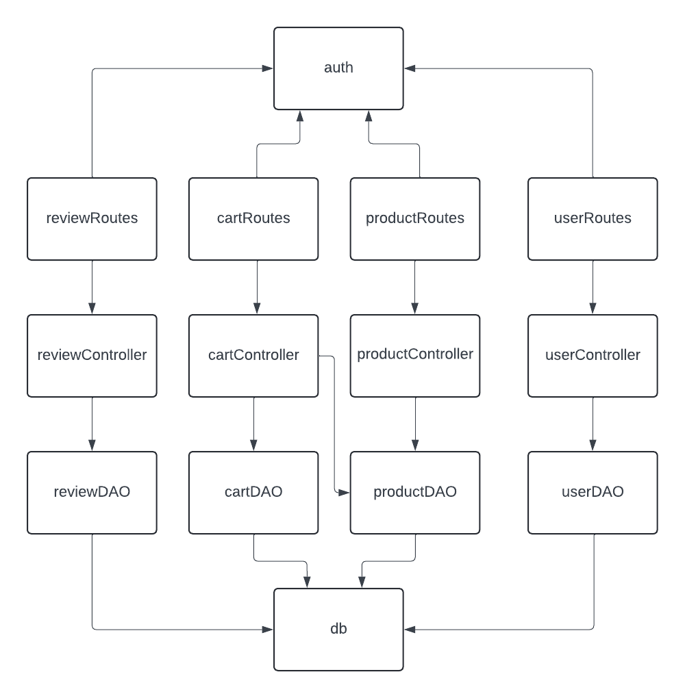
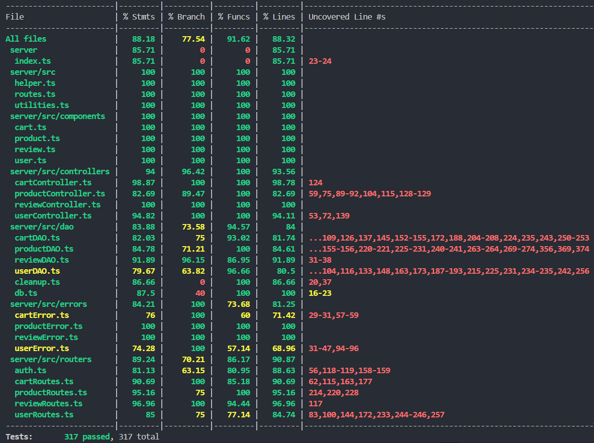

# Test Report

<The goal of this document is to explain how the application was tested, detailing how the test cases were defined and what they cover>

# Contents

- [Test Report](#test-report)
- [Contents](#contents)
- [Dependency graph](#dependency-graph)
- [Integration approach](#integration-approach)
- [Tests](#tests)
- [Coverage](#coverage)
  - [Coverage of FR](#coverage-of-fr)
  - [Coverage white box](#coverage-white-box)

# Dependency graph

     <report the here the dependency graph of EzElectronics>

{width=50%}

# Integration approach

    <Write here the integration sequence you adopted, in general terms (top down, bottom up, mixed) and as sequence

    (ex: step1: unit A, step 2: unit A+B, step 3: unit A+B+C, etc)>

    <Some steps may  correspond to unit testing (ex step1 in ex above)>

    <One step will  correspond to API testing, or testing unit route.js>

    TOP-DOWN APPROACH
    1) Unit-tests of Routes
    2) Unit-tests of Controllers
    3) Unit-tests of DAOs
    4) Integration-testing (Routes+Controllers+DAOs)

# Tests

<in the table below list the test cases defined For each test report the object tested, the test level (API, integration, unit) and the technique used to define the test case (BB/ eq partitioning, BB/ boundary, WB/ statement coverage, etc)> <split the table if needed>

| Test case name                            | Object(s) tested                          | Test level  | Technique used |
| :---------------------------------------: | :---------------------------------------: | :---------: | :------------: |
| userRoutes: POST /users                   | userRoutes, auth                          | Unit        | BB             |
| userRoutes: GET /users                    | userRoutes, auth                          | Unit        | BB             |
| userRoutes: GET /users/roles/:role        | userRoutes, auth                          | Unit        | BB             |
| userRoutes: GET /users/:username          | userRoutes, auth                          | Unit        | BB             |
| userRoutes: DELETE /users/:username       | userRoutes, auth                          | Unit        | BB             |
| userRoutes: DELETE /users                 | userRoutes, auth                          | Unit        | BB             |
| userRoutes: PATCH /users/:username        | userRoutes, auth                          | Unit        | BB             |
| userController: createUser                | userController                            | Unit        | WB             |
| userController: getUsers                  | userController                            | Unit        | WB             |
| userController:getUsersByRole             | userController                            | Unit        | WB             |
| userController: getUserByUsername         | userController                            | Unit        | WB             |
| userController: deleteUser                | userController                            | Unit        | WB             |
| userController: deleteAll                 | userController                            | Unit        | WB             |
| userController: updateUserInfo            | userController                            | Unit        | WB             |
| userDAO: createUser                       | userDAO                                   | Unit        | BB             |
| userDAO: getUserByUsername                | userDAO                                   | Unit        | BB             |
| userDAO: getAllUsers                      | userDAO                                   | Unit        | BB             |
| userDAO: getUsersByRole                   | userDAO                                   | Unit        | BB             |
| userDAO: deleteAll                        | userDAO                                   | Unit        | BB             |
| userDAO: deleteByUsername                 | userDAO                                   | Unit        | BB             |
| userDAO: updateUser                       | userDAO                                   | Unit        | BB             |
| userAPIs: POST /users                     | userRoutes, userController, userDAO, auth | Integration | BB             |
| userAPIs: GET /users                      | userRoutes, userController, userDAO, auth | Integration | BB             |
| userAPIs: GET /users/roles/:role          | userRoutes, userController, userDAO, auth | Integration | BB             |
| userAPIs: GET /users/:username            | userRoutes, userController, userDAO, auth | Integration | BB             |
| userAPIs: DELETE /users/:username         | userRoutes, userController, userDAO, auth | Integration | BB             |
| userAPIs: DELETE /users                   | userRoutes, userController, userDAO, auth | Integration | BB             |
| userAPIs: PATCH /users/:username          | userRoutes, userController, userDAO, auth | Integration | BB             |
| cartRoutes: GET /carts                    | cartRoutes, auth                          | Unit        | BB             |
| cartRoutes: POST /carts                   | cartRoutes, auth                          | Unit        | BB             |
| cartRoutes: PATCH /carts                  | cartRoutes, auth                          | Unit        | BB             |
| cartRoutes: GET /carts/history            | cartRoutes, auth                          | Unit        | BB             |
| cartRoutes: DELETE /carts/products/:model | cartRoutes, auth                          | Unit        | BB             |
| cartRoutes: DELETE /carts/current         | cartRoutes, auth                          | Unit        | BB             |
| cartRoutes: DELETE /carts                 | cartRoutes, auth                          | Unit        | BB             |
| cartRoutes: GET /carts/all                | cartRoutes, auth                          | Unit        | BB             |
| cartController: getCart                   | cartController                            | Unit        | WB             |
| cartController: addToCart                 | cartController                            | Unit        | WB             |
| cartController: checkoutCart              | cartController                            | Unit        | WB             |
| cartController: getCustomerCarts          | cartController                            | Unit        | WB             |
| cartController: removeProductFromCart     | cartController                            | Unit        | WB             |
| cartController: clearCart                 | cartController                            | Unit        | WB             |
| cartController: deleteAllCarts            | cartController                            | Unit        | WB             |
| cartController: getAllCarts               | cartController                            | Unit        | WB             |
| cartDAO: getCurrentCart                   | cartDAO                                   | Unit        | BB             |
| cartDAO: getCartProducts                  | cartDAO                                   | Unit        | BB             |
| cartDAO: addCart                          | cartDAO                                   | Unit        | BB             |
| cartDAO: addCartProduct                   | cartDAO                                   | Unit        | BB             |
| cartDAO: updateCart                       | cartDAO                                   | Unit        | BB             |
| cartDAO: updateCartProduct                | cartDAO                                   | Unit        | BB             |
| cartDAO: getAllCarts                      | cartDAO                                   | Unit        | BB             |
| cartDAO: deleteAllCarts                   | cartDAO                                   | Unit        | BB             |
| cartDAO: deleteCartProducts               | cartDAO                                   | Unit        | BB             |
| cartDAO: deleteCartProduct                | cartDAO                                   | Unit        | BB             |
| cartDAO: getOldCarts                      | cartDAO                                   | Unit        | BB             |
| cartAPIs: GET /carts                      | cartRoutes, cartController, cartDAO, auth | Integration | BB             |
| cartAPIs: POST /carts                     | cartRoutes, cartController, cartDAO, auth | Integration | BB             |
| cartAPIs: PATCH /carts                    | cartRoutes, cartController, cartDAO, auth | Integration | BB             |
| cartAPIs: GET /carts/history              | cartRoutes, cartController, cartDAO, auth | Integration | BB             |
| cartAPIs: DELETE /carts/products/:model   | cartRoutes, cartController, cartDAO, auth | Integration | BB             |
| cartAPIs: DELETE /carts/current           | cartRoutes, cartController, cartDAO, auth | Integration | BB             |
| cartAPIs: DELETE /carts                   | cartRoutes, cartController, cartDAO, auth | Integration | BB             |
| cartAPIs: GET /carts/all                  | cartRoutes, cartController, cartDAO, auth | Integration | BB             |
| productRoutes: POST /products                   | productRoutes, auth                          | Unit        | BB             |
| productRoutes: GET /products                    | productRoutes, auth                          | Unit        | BB             |
| productRoutes: PATCH /products/:model                 | productRoutes, auth                          | Unit        | BB             |
| productRoutes: PATCH /products/sell            | productRoutes, auth                          | Unit        | BB             |
| productRoutes: GET /products/available | productRoutes, auth                          | Unit        | BB             |
| productRoutes: GET /products/:category         | productRoutes, auth                          | Unit        | BB             |
| productRoutes: GET /products/:model=iPhone14                 | productRoutes, auth                          | Unit        | BB             |
| productRoutes: DELETE /products                | productRoutes, auth                          | Unit        | BB             |
| productRoutes: DELETE /products/:model                | productRoutes, auth                          | Unit        | BB             |
| productController: registerProducts                   | productController                            | Unit        | WB             |
| productController: changeProductQuantity                 | productController                            | Unit        | WB             |
| productController: sellProduct              | productController                            | Unit        | WB             |
| productController: getAvailableProducts          | productController                            | Unit        | WB             |
| productController: getProducts     | productController                            | Unit        | WB             |
| productController: deleteAllProducts                 | productController                            | Unit        | WB             |
| productController: deleteProduct            | productController                            | Unit        | WB             |
| productController: getAllCarts               | productController                            | Unit        | WB             |
| productDAO: registerProducts                  | productDAO                                   | Unit        | BB             |
| productDAO: addCchangeProductQuantityart                          | productDAO                                   | Unit        | BB             |
| productDAO: sellProduct                   | productDAO                                   | Unit        | BB             |
| productDAO: getAvailableProducts                       | productDAO                                   | Unit        | BB             |
| productDAO: getProducts                | productDAO                                   | Unit        | BB             |
| productDAO: deleteAllProducts                      | productDAO                                   | Unit        | BB             |
| productDAO: deleteProduct                   | productDAO                                   | Unit        | BB             |
| productAPIs: POST /products                      | productRoutes, productController, productDAO, auth | Integration | BB             |
| productAPIs: GET /products                     | productRoutes, productController, productDAO, auth | Integration | BB             |
| productAPIs: PATCH /products/:model                    | productRoutes, productController, productDAO, auth| Integration | BB             |
| productAPIs: PATCH /products/sell              | productRoutes, productController, productDAO, auth | Integration | BB             |
| productAPIs: GET /products/available   |  productRoutes, productController, productDAO, auth | Integration | BB             |
| productAPIs: GET /products/:category           | productRoutes, productController, productDAO, auth | Integration | BB             |
| productAPIs: GET /products/:model                   | productRoutes, productController, productDAO, auth | Integration | BB             |
| productAPIs: DELETE /products                  | productRoutes, productController, productDAO, auth | Integration | BB             |
| productAPIs: DELETE /products/:model                  | productRoutes, productController, productDAO, auth | Integration | BB             |
| reviewRoutes: GET /reviews/:model           | reviewRoutes, auth                              | Unit        | BB           |
| reviewRoutes: POST /reviews/:model          | reviewRoutes, auth                              | Unit        | BB           |
| reviewRoutes: DELETE /reviews/:model        | reviewRoutes, auth                              | Unit        | BB           |
| reviewRoutes: DELETE /reviews/:model/all    | reviewRoutes, auth                              | Unit        | BB           |
| reviewRoutes: DELETE /reviews/              | reviewRoutes, auth                              | Unit        | BB           |
| reviewController: addReview                 | reviewController                                | Unit        | WB           |
| reviewController: getProductReviews         | reviewController                                | Unit        | WB           |
| reviewController: deleteReview              | reviewController                                | Unit        | WB           |
| reviewController: deleteReviewsForProduct   | reviewController                                | Unit        | WB           |
| reviewController: deleteAllReviews          | reviewController                                | Unit        | WB           |
| reviewDAO: getProductReviews                | reviewDAO                                       | Unit        | BB           |
| reviewDAO: addReview                        | reviewDAO                                       | Unit        | BB           |
| reviewDAO: deleteReview                     | reviewDAO                                       | Unit        | BB           |
| reviewDAO: deleteProductReview              | reviewDAO                                       | Unit        | BB           |
| reviewDAO: deleteAllReviews                 | reviewDAO                                       | Unit        | BB           |
| reviewAPIs: GET /reviews/:model             | reviewRoutes, reviewController, reviewDAO, auth | Integration | BB           |
| reviewAPIs: POST /reviews/:model            | reviewRoutes, reviewController, reviewDAO, auth | Integration | BB           |
| reviewAPIs: DELETE /reviews/:model          | reviewRoutes, reviewController, reviewDAO, auth | Integration | BB           |
| reviewAPIs: DELETE /reviews/:model/all      | reviewRoutes, reviewController, reviewDAO, auth | Integration | BB           |
| reviewAPIs: DELETE /reviews/                | reviewRoutes, reviewController, reviewDAO, auth | Integration | BB           |
  

# Coverage

## Coverage of FR

<Report in the following table the coverage of functional requirements and scenarios(from official requirements) >

| Functional Requirement or scenario | Test(s)  |
| :--------------------------------: | :-----: |
|  FR1.3: Create a new user account  | userRoute: POST /users, userController: createUser, userDAO: createUser, User APIs: POST /users |
|  FR2.1: Show the list of all users | userRoute: GET /users, userController: getUsers, userDAO: getAllUsers, User APIs: GET /users |
|  FR2.2: Show the list of all users with a specific role | userRoute: GET /users/roles/:role, userController: getUsersByRole, userDAO: getUsersByRole, User APIs: GET /users/roles/:role |
|  FR2.3: Show the information of a single user| userRoute: GET /users/:username, userController: getUserByUsername, userDAO: getUserByUsername, User APIs: GET /users/:username |
|  FR2.4: Update the information of a single user | userRoute: PATCH /users/:username, userController: updateUserInfo, userDAO: updateUser, User APIs: PATCH /users/:username |
|  FR2.5: Delete a single non Admin user | userRoute: DELETE /users/:username, userController: deleteUser, userDAO: deleteByUsername, User APIs: DELETE /users/:username |
|  FR2.6: Delete all non Admin users | userRoute: DELETE /users, userController: deleteAll, userDAO: deleteAll, User APIs: DELETE /users |
|  FR3.1: Register a set of new products  | productRoute: POST /products, (productController: registerProducts), productDAO: registerProducts, Product APIs: POST /products     |
|  FR3.2: Update the quantity of a product | productRoute: PATCH /products/:model, productController: changeProductQuantity, productDAO: changeProductQuantity, Product APIs: PATCH /products |
|  FR3.3: Sell a product| productRoute: PATCH /products/:model/sell, productController: sellProduct, productDAO: sellProduct, Product APIs: PATCH /products |
|  FR3.4: Show the list of all products  | productRoute: GET /products, productController: (getProducts,getAvailableProducts), productDAO: (getProducts,getAvailableProducts) APIs: PATCH /products |
|  FR3.5: Show the list of all products with the same category | productRoute: GET /products/:category, productController: (getProducts,getAvailableProducts), productDAO: (getProducts, getAvailableProducts), Product APIs: PATCH /products |
|  FR3.6: Show the list of all products with the same model| productRoute: GET /products/:model, productController: (getProducts,getAvailableProducts), productDAO: (getProducts, getAvailableProducts), Product APIs: PATCH /products |
|  FR3.7: Delete a product| productRoute: DELETE /products/:model, productController: deleteProduct, productDAO: deleteProduct, Product APIs: DELETE /products/:model |
|  FR3.8: Delete all products| productRoute: DELETE /products, productController: deleteProduct, productDAO: deleteProduct, Product APIs: DELETE /products |
|  FR4.1: Add a new review to a product | reviewRoute: POST /reviews/:model, reviewController: addReview, reviewDAO: addReview, reviewAPIs: POST /reviews/:model    |
|  FR4.2: Get the list of all reviews assigned to a product | reviewRoute: GET /reviews/:model, reviewController: getProductReviews, reviewDAO: getProductReviews, reviewAPIs: GET /reviews/:model    |
|  FR4.3: Delete a review given to a product | reviewRoute: DELETE /reviews/:model, reviewController: deleteReview, reviewDAO: deleteReview, reviewAPIs: DELETE /reviews/:model    |
|  FR4.4: Delete all reviews of a product | reviewRoute: DELETE /reviews/:model/all, reviewController: deleteReviewsForProduct, reviewDAO: deleteProductReview, reviewAPIs: DELETE /reviews/:model/all   |
|  FR4.5: Delete all reviews of all products | reviewRoute: DELETE /reviews/, reviewController: deleteAllReviews, reviewDAO: deleteAllReviews, reviewAPIs: DELETE /reviews/  |
|  FR5.1: Show the information of the current cart | cartRoute: GET /carts, cartController: getCart, cartDAO: getCurrentCart, cartAPIs: GET /carts     |
|  FR5.2: Add a product to the current cart | cartRoute: POST /carts, cartController: addToCart, cartDAO: addCartProduct, cartAPIs: POST /carts |
|  FR5.3: Checkout the current cart | cartRoute: PATCH /carts, cartController: checkoutCart, cartDAO: (getCurrentCart, getProductByModel, updateCart updateCartProduct), cartAPIs: POST /carts |
|  FR5.4: Show the history of the paid carts | cartRoute: GET /carts/history, cartController: getCustomerCarts, cartDAO: getOldCarts, cartAPIs: GET /carts/history |
|  FR5.5: Remove a product from the current cart | cartRoutes: DELETE /carts/products/:model, cartController: removeProductFromCart, cartDAO: (getCurrentCart, getProductByModel, updateCart, updateCartProduct), cartAPIs: DELETE /carts/products/:model |
|  FR5.6: Delete the current cart | cartRoutes: DELETE /carts/current, cartController: clearCart, cartDAO: (getCurrentCart, updateCart, deleteCartProducts), cartAPIs: DELETE /carts/current |
|  FR5.7: See the list of all carts of all users | cartRoutes: GET /carts/all, cartController: getAllCarts, cartDAO: getAllCarts, cartAPIs: GET /carts/all |
|  FR5.8: Delete all carts| cartRoutes: DELETE /carts, cartController: deleteAllCarts, cartDAO: deleteAllCarts, cartAPIs: DELETE /carts |

## Coverage white box

Report here the screenshot of coverage values obtained with jest-- coverage

